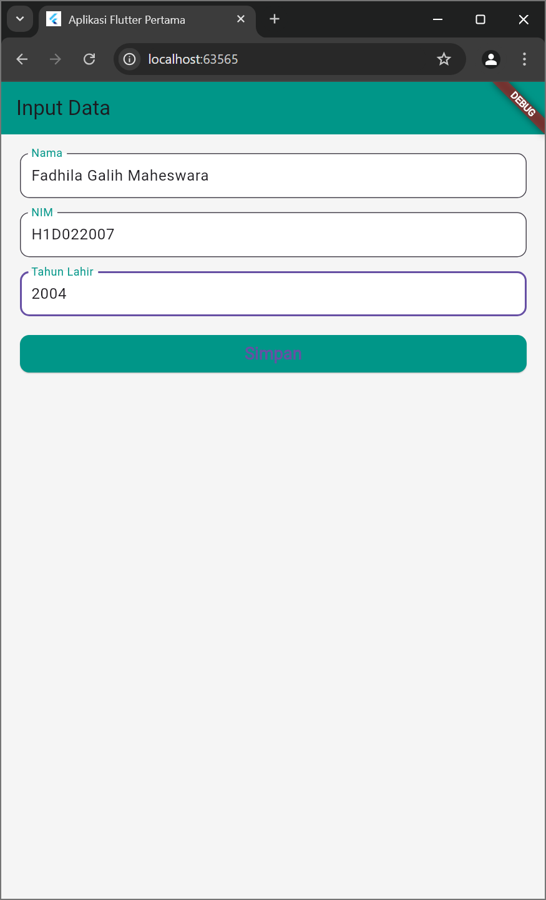
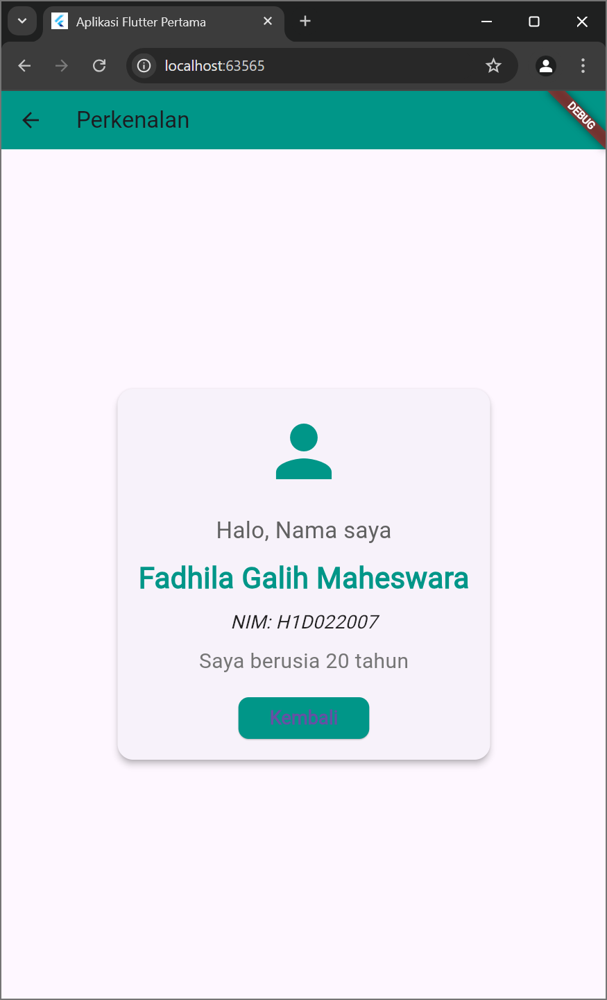

# Tugas Pertemuan 2

Fork dan clone repository ini, lalu jalankan perintah 
```
flutter pub get
```
Buatlah tampilan form yang berisi nama, nim, dan tahun lahir pada file `ui/form_data.dart`, lalu buatlah tampilan hasil dari input data tersebut pada file `ui/tampil_data.dart`

JELASKAN PROSES PASSING DATA DARI FORM MENUJU TAMPILAN DENGAN FILE `README.md`

Buat tampilan semenarik mungkin untuk dilihat.

---------------------------------------------------------------------------------------------------------------------------------------------------------------------

Nama : Fadhila Galih Maheswara

NIM : H1D022007

Shift Baru: D

1. Pengumpulan Data di FormData
   Dalam widget from_data, menggunakan TextEditingController untuk setiap field input:

2. Persiapan Data untuk Passing
   Saat tombol "Simpan" ditekan, kita mengambil nilai dari controller:

3. Navigasi dan Passing Data
   Menggunakan Navigator untuk berpindah ke halaman tampil_data sambil meneruskan data

4. Penerimaan Data di TampilData 
   kelas tampil_data digunakan untuk menerima data

5. Penggunaan Data pada TampilData
   Setelah data diterima, tampil_data menggunakannya untuk membuat tampilan

## Screenshot
Contoh :


